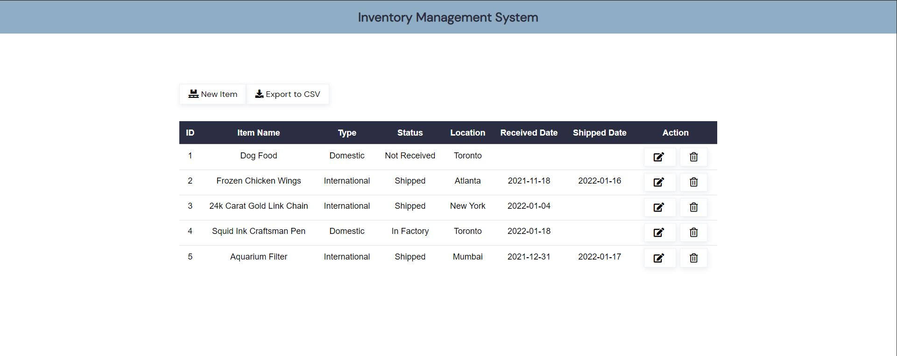

# Shopify-2022-Backend-Intern
This is my submission for the Shopify Backend Developer Intern Challenge - Summer 2022!

To run locally:
- clone repository onto local disk
- open any terminal
- use the command "npm install" to secure node modules
- use the command "npm start" to run the project locally at "localhost:3000"
- create, read, update, delete, and csv export the inventory area!

This application is a simple, scalable inventory tracking application using MongoDB, Express, and Node. 
The extra feature in addition to the CRUD functionality is the CSV export, but many other features can quite easily be added, as the application has a robust structure.

This project assumes any individual running it has node / npm installed on their computer, but if not, the link is provided below:
https://nodejs.org/en/download/

